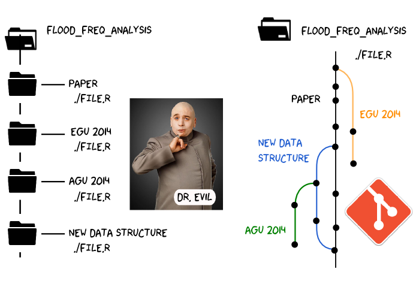
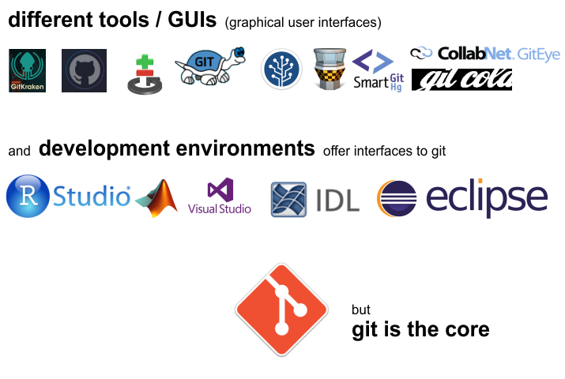

Version control with git
========================================================
author: Erwin Rottler
date: 26.10.2018
autosize: true

First Slide
========================================================

### Question:    
What is version control and why should I use it?

### Objectives:    
Understand the benefits of an automated version control system.    
Understand the basics of Git.

Distributed version control system
========================================================

### Version control system
System that records changes to a file or set of files over time so that you can recall specific versions later.

### Distributed   
Means that there is no main server and all of the full history of the project is available once you clone the project

Why verion control?
========================================================

### A long-lasting project has:

* different people working on it
* many project stages and program versions
* a lot of changes on the way of getting there

**A version control system traces all these steps (changes, versions, people) in your project history.**

Why verion control?
========================================================

* no longer hundrets of file versions with non-informative names
* documentation of projects for passing between persons / transferring it
* **common tool for transparent and sustainable work flow**
* increase efficiency (for group work)

Why git?
========================================================

* it's free (open)
* non-linear development
* saves project history
* distributed (GitHub, GitLab, Bitbucket,...)
* cross platform
* very popular

Why git?
========================================================

Use git
========================================================

NRC commit
========================================================

